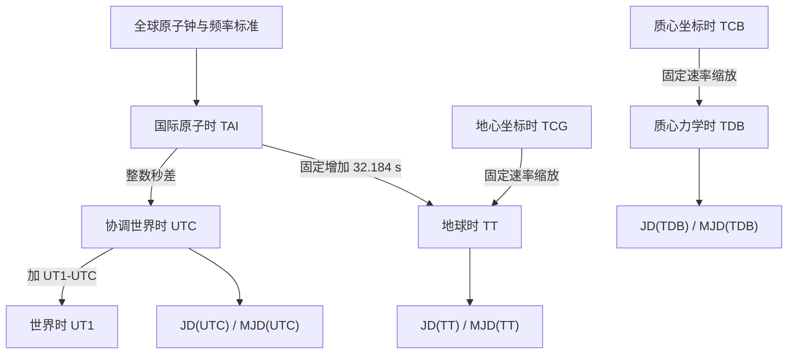
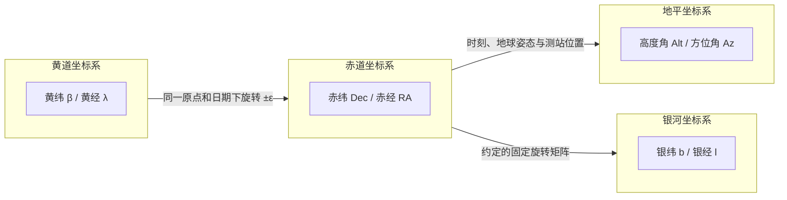
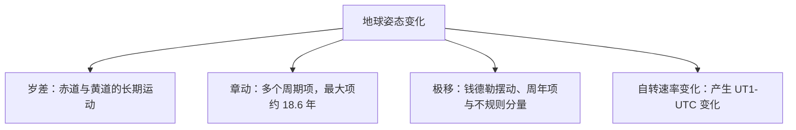

空间测控只有同时明确时间尺度、坐标参考系和地球姿态模型，才能把卫星轨道状态转换为地面站指向。时间戳还要注明 UTC、UT1、TT 或 TDB，坐标则要注明原点、轴方向、参考架和历元。省略其中任何一项，都可能把相同的数字解释成不同的时刻或方向。

## 时间尺度、地球自转与日期表示

时间尺度规定怎样给物理事件编号，儒略日期则把所选时间尺度写成连续的日数。JD 和 MJD 不是独立时间尺度，精密计算必须写成 $JD(\mathrm{TT})$、$JD(\mathrm{UT1})$ 或 $JD(\mathrm{UTC})$ 等形式。[BIPM 的时间尺度定义][bipm-timescales]与 [IAU SOFA 时间工具][sofa-time]采用这种区分。

| 时间尺度 | 定义或关系 | 常见用途 |
| --- | --- | --- |
| TAI | BIPM 根据全球原子钟和一级、二级频率标准计算的连续原子时标 | 时间与频率计量 |
| UTC | 与 TAI 速率相同，相差整数秒，现行制度包含闰秒 | 国际民用时间与系统接口 |
| UT1 | 与地球自转角 ERA 线性相关，由 IERS 根据 VLBI 等观测确定 | 地球姿态、恒星时与测站指向 |
| TT、TCG | TCG 是地心坐标时，TT 是 TCG 的固定速率缩放 | 地心星历、岁差章动模型 |
| TDB、TCB | TCB 是质心坐标时，TDB 是 TCB 的固定速率缩放 | 太阳系质心动力学与行星历 |

### 太阳时与均时差

真太阳时由真太阳的当地时角定义。真太阳连续两次上中天的间隔称为真太阳日。地球轨道具有偏心率，地轴又相对轨道面倾斜，太阳的视运动速度因此随季节变化，真太阳日不会始终等于 24 小时。

平太阳时使用一个沿天赤道匀速运动的假想平太阳。均时差表示真太阳时与平太阳时之差，使用时还要注明符号约定。若在每天相同的平太阳时拍摄太阳，太阳赤纬给出南北变化，均时差给出东西变化，两者合成全年可见的 8 字形日行迹（Analemma）。[美国海军天文台的均时差说明][usno-eot]给出了两项效应的几何关系。

### 恒星时与恒星日

恒星时是春分点相对于子午圈的时角。采用平春分点得到平恒星时，采用真春分点得到视恒星时。地方恒星时也等于当时通过当地子午圈天体的赤经。[美国海军天文台的恒星时说明][usno-sidereal]区分了两种定义。

春分点连续两次通过同一子午圈的间隔约为 23 小时 56 分 4 秒。地球每天在公转轨道上前进约 $0.9856^\circ$，所以恒星日比平太阳日短约 3 分 56 秒。一次相对于恒星的公转中，以恒星方向计数的自转圈数比平太阳日数约多 1；严格计算还要区分恒星年、回归年和春分点进动。

### 原子时、世界时与闰秒机制

铯-133 原子基态超精细跃迁频率定义 SI 秒。TAI 使用 SI 秒作为单位并保持连续，实际值由 BIPM 综合各地原子钟和频率标准得到。单台原子钟及 TAI 的实现仍带有测量不确定度。

UT1 描述地球绕天球中间极的自转，现代定义让它与地球自转角 ERA 保持线性关系。IERS 主要通过甚长基线干涉测量观测河外射电源，再发布 $UT1-UTC$。潮汐、海洋、大气、地幔和地核之间的角动量交换都会改变地球自转速率。

UTC 与 TAI 具有相同速率，两者相差整数秒。现行制度在 $\lvert UT1-UTC\rvert$ 预计接近 $0.9\text{ s}$ 时调整 UTC，IERS 负责决定并公告闰秒。制度允许正闰秒和负闰秒，截至 2026 年 8 月 31 日尚未实施过负闰秒。

根据 [IERS Bulletin C 72][iers-c72]，截至该日期有

$$TAI = UTC + 37\text{ s}$$

$$TT(TAI) = TAI + 32.184\text{ s} = UTC + 69.184\text{ s}$$

地面钟到 TAI 的实现需要相对论频移改正，但 $TT(TAI)-TAI$ 的 $32.184\text{ s}$ 是定义偏移。TT 适用于地心星历和岁差章动模型。太阳系质心计算使用 TCB，或使用由 TCB 线性缩放得到的 TDB。地球附近的 $TDB-TT$ 主要是年周期项，振幅约为 $1.7\text{ ms}$，不是固定偏移。[IAU SOFA 时间工具][sofa-time]给出了这些时间尺度之间的转换。

闰秒制度正在调整。[国际计量大会 2022 年第 4 号决议][bipm-utc]要求在 2035 年或以前提高允许的 $\lvert UT1-UTC\rvert$ 上限，使 UTC 在至少一个世纪内保持连续。在新的上限和实施日期正式生效前，现行 $0.9\text{ s}$ 规则仍然有效。

### 儒略日期、修正儒略日期与 J2000.0

儒略日期（Julian Date, JD）记录从前推儒略历公元前 4713 年 1 月 1 日格林尼治平正午起经过的日数和日的小数部分。整数日编号称为 Julian Day Number，缩写为 JDN。

修正儒略日期（Modified Julian Date, MJD）按 [IAU 决议][iau-jd]定义为

$$MJD = JD - 2400000.5$$

这项减法缩短了数值，也把同一时间尺度内的换日点从正午移到午夜。MJD 仍需注明时间尺度。UTC 日在正闰秒时包含 86401 秒，普通 JD 小数无法无歧义地表示这个额外秒，跨闰秒直接相减也不会得到正确的 SI 秒数。IAU SOFA 因此为 UTC 转换使用专门的 quasi-JD 表示。

J2000.0 固定在地心的 2000 年 1 月 1 日 12 时 TT，对应

$$JD(\mathrm{TT}) = 2451545.0$$

这个时刻是 2000 年 1 月 1 日 11 时 58 分 55.816 秒 UTC。2000 年 1 月 1 日 12 时 UTC 的数值同样可写为 $JD(\mathrm{UTC})=2451545.0$，但它比 J2000.0 晚 64.184 秒。[美国海军天文台的 TT 说明][usno-tt]列出了这些对应关系。

## 四种常用天球坐标系

天球是半径任意的假想球面，中心可按问题取观测者、地心或太阳系质心。除坐标极点外，一个空间方向可用两个球面角表示。卫星的三维位置还需要距离或笛卡尔坐标。

### 地平坐标系

地平坐标系以观测者为原点，以当地地平面为基准面，以天顶方向为正轴。天体方向由高度角（Altitude, $h$ 或 $El$）与方位角（Azimuth, $A$ 或 $Az$）表示。

高度角的完整范围为 $-90^\circ\le h\le+90^\circ$，地面天线通常只跟踪地平线以上的目标。在常用航天与天文约定中，方位角从真北起算，沿地平圈经东顺时针增加，范围为 $0^\circ\le A<360^\circ$。[美国海军天文台的高度角与方位角定义][usno-altaz]采用这一约定。

对卫星目标，系统必须先用卫星位置减去测站位置，得到测站到卫星的拓扑视线向量，再把它转到当地坐标系。方位俯仰式天线可直接使用 Az/El；其他安装形式还要经过天线轴系模型。

### 赤道坐标系

传统赤道坐标系以指定日期的天赤道为基准面，以相应天极为极轴。赤纬（Declination, $\delta$）从天赤道向南北量至 $\pm90^\circ$。赤经（Right Ascension, $\alpha$）沿天赤道向东量，范围为

$$0\le\alpha<24\text{h},\qquad 0^\circ\le\alpha<360^\circ$$

在传统分点体系中，赤经原点是指定日期的春分点，因此坐标必须注明赤道和分点所对应的日期或历元。

现代高精度星表使用国际天球参考系 ICRS。ICRS 由国际天球参考架 ICRF 实现，其轴由遥远河外射电源固定。它与 J2000.0 动力学赤道和分点非常接近，但不由移动的地球赤道或春分点定义，也没有绑定的标准历元。[美国海军天文台的 ICRS 说明][usno-icrs]给出了两套体系之间的区别。

赤经和赤纬适合表达星表位置与角度观测。卫星状态和开普勒轨道根数还必须注明 GCRF、EME2000、TEME 或其他参考架，RA/Dec 本身不是轨道六根数。[CCSDS 轨道数据消息标准][ccsds-odm]要求轨道数据明确携带参考架和时间系统。

### 黄道坐标系

黄道坐标系以指定的黄道面为基准面。[IAU 2006 年第 B1 号决议][iau-ecliptic]把黄极定义为 BCRS 中地月质心平均轨道角动量向量的方向。把黄道面近似描述为地球绕太阳公转的轨道面，适合入门说明。

黄纬（Ecliptic Latitude, $\beta$）从黄道面量至 $\pm90^\circ$。黄经（Ecliptic Longitude, $\lambda$）从相应分点沿黄道向东量，范围为 $0^\circ\le\lambda<360^\circ$。黄道、赤道和分点必须采用相同的日期或历元，才能把两套坐标简化为黄赤交角旋转。

IAU 2006 模型给出的 J2000.0 平黄赤交角为

$$\varepsilon_0=84381.406^{\prime\prime}=23^\circ26^{\prime}21.406^{\prime\prime}$$

按同一模型计算，2026 年 8 月 31 日的平黄赤交角约为

$$\varepsilon_A\approx23^\circ26^{\prime}8.918^{\prime\prime}$$

瞬时真黄赤交角还包含章动分量 $\Delta\varepsilon$。[IERS Conventions 第 5 章][iers-ch5]给出了平黄赤交角的计算式。

黄道坐标适合表达太阳系天体的视位置和轨道几何。现代高精度 JPL 行星历在与 ICRF 对齐的质心参考架内计算，再按输出需要转换到黄道坐标。[JPL DE440 与 DE441 说明][jpl-de440]记录了其参考架和 TDB 时间参数。

### 银河坐标系

银河坐标系是约定坐标系。约定银道面近似银河系中面，其方向由银河北极和银经零点共同固定。[IAU 1958 银河坐标系报告][iau-galactic]记录了这套定义。

银纬（Galactic Latitude, $b$）从约定银道面量至 $\pm90^\circ$。银经（Galactic Longitude, $l$）沿银道面量取 $0^\circ\le l<360^\circ$。零点接近银河中心方向，但没有精确落在射电源 Sgr A\* 上。观测给出的 Sgr A\* 坐标约为

$$(l,b)\approx(359.944^\circ,-0.046^\circ)$$

[CDS SIMBAD 数据库][sgr-a-coordinates]列出了这一位置。银河坐标主要用于银河结构、银河源族群和全天巡天图。深空导航和精密射电天体测量采用 ICRS/ICRF，[JPL 深空网射电源目录][jpl-dsn]以 ICRF3 为角位置基准。

## 四种坐标系统参数对照

| 坐标系 | 基准面或轴 | 经度型坐标 | 纬度型坐标 | 常见用途 |
| --- | --- | --- | --- | --- |
| 地平坐标系 | 测站当地地平面 | 方位角 $0^\circ\le Az<360^\circ$ | 高度角 $-90^\circ\le El\le90^\circ$ | 测站视线和方位俯仰指向 |
| 赤道坐标系 | 指定日期的赤道，或 ICRS 约定轴 | 赤经 $0\le RA<24\text{h}$ | 赤纬 $-90^\circ\le Dec\le90^\circ$ | 星表、光学与射电测角 |
| 黄道坐标系 | 指定日期或历元的黄道面 | 黄经 $0^\circ\le\lambda<360^\circ$ | 黄纬 $-90^\circ\le\beta\le90^\circ$ | 太阳系天体位置和轨道几何 |
| 银河坐标系 | 约定银道面 | 银经 $0^\circ\le l<360^\circ$ | 银纬 $-90^\circ\le b\le90^\circ$ | 银河结构和源分布 |

## 地球姿态与参考历元

地球具有弹性地幔、流体核、海洋和大气。太阳、月球及较小的行星力矩改变地轴在空间中的方向，地球内部和表层的角动量交换还会改变极移与自转速率。

### 岁差

太阳和月球对地球赤道隆起的引力力矩产生赤道岁差，地球轨道面的缓慢变化构成黄道岁差。两者共同决定赤道相对黄道的一般岁差。[IAU 2006 年第 B1 号决议][iau-ecliptic]建议使用“赤道岁差”和“黄道岁差”，避免把全部效应概括成旧称“日月岁差”。

在简化几何图像中，天北极沿半径约 $23.4^\circ$ 的路径绕黄极运动，完成一周约需 26000 年。J2000.0 附近的一般岁差黄经速率约为每年 $50.3^{\prime\prime}$，对应天极在天球路径上的弧长速度约为每年 $20^{\prime\prime}$。这条路径并非严格圆形，进动速率也不是跨越数万年的常数。[USNO Circular 179][usno-c179]给出了 IAU 岁差章动模型和角速度定义。

### 章动与极移

月球轨道面相对黄道面倾斜约 $5^\circ9^{\prime}$，其升交点约每 18.6 年退行一周。这一周期产生最大的章动项，完整章动模型还包含许多其他日月项和较小的行星项。

最大 18.6 年项的黄经章动振幅约为 $17.2^{\prime\prime}$，交角章动振幅约为 $9.2^{\prime\prime}$。单独写“章动振幅为 $9.2^{\prime\prime}$”会遗漏黄经分量。[IERS Conventions 第 5 章][iers-ch5]中的 IAU 2000A 模型包含日月项和行星项。

极移描述天球中间极相对地壳的运动，包含钱德勒摆动、周年项和其他不规则分量。它与天极在惯性空间中的岁差章动属于不同环节，IERS 通过地球定向参数 $x_p$、$y_p$ 发布观测结果。

### 平位置、视位置与历元

在传统分点体系中，平赤道和平春分点包含岁差而不包含章动，真赤道和真春分点同时包含岁差与章动。经典视位置经过适用的自行、视差、光行时、引力偏折和光行差处理，并表达在观测日期的真赤道和真春分点上。[IAU SOFA 天体测量工具][sofa-astrometry]展示了从星表位置到观测方向的完整链条。

IAU 在 1976 年推荐 J2000.0 作为新的标准历元和分点。[IAU 1976 年决议][iau-1976]给出的历元是

$$2000\text{ 年 }1\text{ 月 }1.5\ \mathrm{TT}=JD(\mathrm{TT})\ 2451545.0$$

J2000.0 只定义历元。ICRS 于 1997 年获 IAU 采用，并从 1998 年 1 月 1 日起取代 FK5。ICRS 的固定轴与 J2000.0 动力学赤道和分点接近，但两者存在可测的框架偏置。[美国海军天文台的 ICRS 说明][usno-icrs]记录了这次替换。空间工程还需明确区分 GCRS、GCRF、EME2000 和 TEME 等参考架。

## GCRS 到 ITRS 与测站指向

以下转换只讨论地心天球参考系统 GCRS 和国际地球参考系统 ITRS。ECI 和 ECEF 只是参考系类别，不能唯一确定算法。EME2000、TEME、GCRF 或 WGS 84 数据必须先按各自定义接入同一条转换链。

ITRF 是 ITRS 的测站坐标与速度实现。WGS 84 是另一套地球参考框架，[NGA 的 WGS 84 说明][nga-wgs84]指出当前实现有意与 ITRF 对齐到三维各分量约 1 厘米，但两者仍需分别注明实现版本和参考历元。

[IERS Conventions 第 5 章][iers-ch5]把 ITRS 到 GCRS 的列向量变换写成

$$
\left[\mathbf r\right]_{\mathrm{GCRS}}
=
\mathbf Q(TT,dX,dY)\,
\mathbf R(UT1)\,
\mathbf W(x_p,y_p,s^{\prime})\,
\left[\mathbf r\right]_{\mathrm{ITRS}}
$$

$\mathbf W$ 把 ITRS 转到地球中间参考系统 TIRS，使用极移参数 $x_p$、$y_p$ 和 TIO 定位量 $s^{\prime}$。$\mathbf R$ 把 TIRS 转到天球中间参考系统 CIRS，CIO 方法使用由 UT1 决定的地球自转角 ERA。$\mathbf Q$ 把 CIRS 转到 GCRS，包含框架偏置、IAU 2006/2000A 岁差章动模型和 IERS 发布的天球极偏差 $dX$、$dY$。

三个矩阵都是正交矩阵，因此 GCRS 到 ITRS 的反向变换为

$$
\left[\mathbf r\right]_{\mathrm{ITRS}}
=
\mathbf W^{\mathsf T}\,
\mathbf R^{\mathsf T}\,
\mathbf Q^{\mathsf T}\,
\left[\mathbf r\right]_{\mathrm{GCRS}}
$$

三个矩阵不能共用一个含义不明的时间参数。$\mathbf Q$ 使用 TT，$\mathbf R$ 使用 UT1，$\mathbf W$ 使用同一观测时刻的地球定向参数。若输入为 UTC 时间戳，则按

$$TT=UTC+(TAI-UTC)+32.184\text{ s}$$

$$UT1=UTC+(UT1-UTC)$$

得到所需时标。$TAI-UTC$ 来自闰秒公告，$UT1-UTC$、$x_p$、$y_p$、$dX$ 和 $dY$ 来自 IERS 地球定向参数。工程实现可采用 [IAU SOFA][sofa-astrometry]提供的标准例程，避免混用符号方向不同的旋转矩阵。

得到卫星的 ITRS 坐标后，还要减去测站坐标，形成测站看到的几何视线向量。测站坐标应注明 ITRF 实现和参考历元，精密计算还要传播测站速度。

$$
\boldsymbol{\rho}_{\mathrm{ITRS}}
=
\mathbf r_{\mathrm{sat,ITRS}}
-
\mathbf r_{\mathrm{sta,ITRS}}
$$

设测站大地纬度为 $\varphi$，东经为 $\lambda$。把视线向量转到当地东、北、天顶坐标系可写成

$$
\begin{bmatrix}
E\\
N\\
U
\end{bmatrix}
=
\begin{bmatrix}
-\sin\lambda & \cos\lambda & 0\\
-\sin\varphi\cos\lambda & -\sin\varphi\sin\lambda & \cos\varphi\\
\cos\varphi\cos\lambda & \cos\varphi\sin\lambda & \sin\varphi
\end{bmatrix}
\boldsymbol{\rho}_{\mathrm{ITRS}}
$$

在方位角从真北起算并向东顺时针增加的约定下，

$$Az=\operatorname{mod}\!\left(\operatorname{atan2}(E,N),2\pi\right)$$

$$El=\operatorname{atan2}\!\left(U,\sqrt{E^2+N^2}\right)$$

$$\rho=\sqrt{E^2+N^2+U^2}$$

当天体位于天顶时，$E=N=0$，方位角没有定义。[ESA 的 ECEF 与 ENU 转换说明][esa-enu]可用于核对上述局部旋转。

这些公式给出同一时刻的几何方向。精密测控还要按观测类型处理光行时、测站位移、大气折射和天线轴系误差。[IERS 的地面观测方向说明][iers-direction]列出了高精度方向计算所需的输入。

## 参考资料

- [BIPM，第 26 届国际计量大会第 2 号决议][bipm-timescales]
- [BIPM，第 27 届国际计量大会第 4 号决议][bipm-utc]
- [IERS Bulletin C 72][iers-c72]
- [IAU SOFA 时间尺度与日历工具][sofa-time]
- [IAU SOFA 天体测量工具][sofa-astrometry]
- [IERS Conventions 2010，第 5 章][iers-ch5]
- [IAU 1976 年决议][iau-1976]
- [IAU 1997 年 JD 与 MJD 决议][iau-jd]
- [IAU 2006 年第 B1 号决议][iau-ecliptic]
- [CCSDS，轨道数据消息标准][ccsds-odm]
- [美国海军天文台，均时差][usno-eot]
- [美国海军天文台，恒星时][usno-sidereal]
- [美国海军天文台，高度角与方位角][usno-altaz]
- [美国海军天文台，地球时与 J2000.0][usno-tt]
- [美国海军天文台，国际天球参考系][usno-icrs]
- [美国海军天文台，Circular 179][usno-c179]
- [JPL，DE440 与 DE441 行星月球历][jpl-de440]
- [IAU 1958 银河坐标系报告][iau-galactic]
- [CDS SIMBAD，Sgr A\* 坐标][sgr-a-coordinates]
- [JPL 深空网，X 波段射电源目录][jpl-dsn]
- [NGA，WGS 84 参考框架][nga-wgs84]
- [ESA，ECEF 与 ENU 坐标转换][esa-enu]
- [IERS，地面观测方向所需信息][iers-direction]

[bipm-timescales]: https://www.bipm.org/en/committees/cg/cgpm/26-2018/resolution-2
[bipm-utc]: https://www.bipm.org/en/-/resolution-cgpm-27-4
[iers-c72]: https://datacenter.iers.org/data/html/bulletinc-072.html
[sofa-time]: https://www.iausofa.org/s/sofa_ts_c.pdf
[sofa-astrometry]: https://www.iausofa.org/s/sofa_ast_c.pdf
[usno-eot]: https://aa.usno.navy.mil/faq/eqtime
[usno-sidereal]: https://aa.usno.navy.mil/faq/GAST
[iau-jd]: https://www.iau.org/static/resolutions/IAU1997_French.pdf
[usno-tt]: https://aa.usno.navy.mil/faq/TT
[usno-altaz]: https://aa.usno.navy.mil/faq/alt_az
[usno-icrs]: https://aa.usno.navy.mil/faq/ICRS_doc
[ccsds-odm]: https://ccsds.org/Pubs/502x0b3e1.pdf
[iau-ecliptic]: https://www.iau.org/static/resolutions/IAU2006_Resol1.pdf
[iers-ch5]: https://iers-conventions.obspm.fr/content/chapter5/icc5.pdf
[jpl-de440]: https://ssd.jpl.nasa.gov/doc/Park.2021.AJ.DE440.pdf
[iau-galactic]: https://academic.oup.com/mnras/article/121/2/123/2604025
[sgr-a-coordinates]: https://simbad.cds.unistra.fr/simbad/sim-basic?Ident=sgr+A
[jpl-dsn]: https://deepspace.jpl.nasa.gov/dsndocs/810-005/107/107F.pdf
[usno-c179]: https://aa.usno.navy.mil/downloads/Circular_179_bw.pdf
[iau-1976]: https://www.iau.org/static/resolutions/IAU1976_French.pdf
[nga-wgs84]: https://earth-info.nga.mil/?action=wgs84&dir=wgs84
[esa-enu]: https://gssc.esa.int/navipedia/index.php/Transformations_between_ECEF_and_ENU_coordinates
[iers-direction]: https://www.iers.org/iers/en/service/faqs/theicrs/req-info
