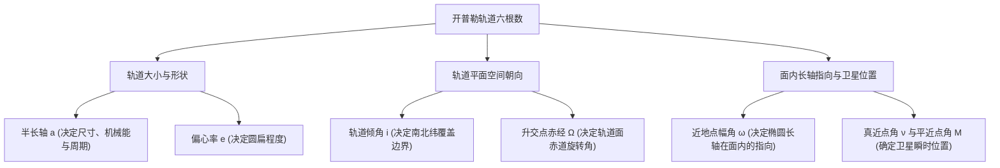
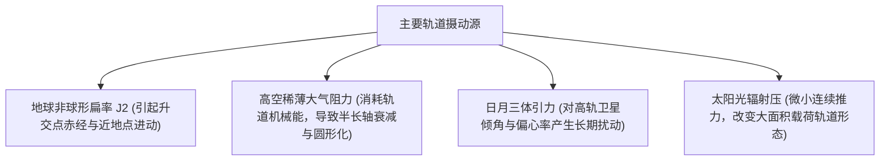

经典开普勒轨道六根数通过 6 个几何与动力学参数，唯一确定卫星在二体引力场中的轨道尺寸、空间姿态以及瞬时运行位置。相比笛卡尔坐标系下的位置与速度矢量，开普勒六根数直接解耦了轨道能量、空间朝向与时间变量。

## 空间自由度与轨道根数解耦

在三维地心惯性坐标系中，完全确定卫星状态需要 6 个自由度。开普勒六根数将其分解为 2 个轨道形状参数、2 个轨道平面姿态参数、1 个面内椭圆方向参数以及 1 个时间位置参数。



## 六根数几何物理定义

### 轨道几何尺寸与能量

半长轴 $a$ 为椭圆长轴长度的一半。该参数直接决定轨道的总机械能与运行周期 $T$。

$$T = 2\pi \sqrt{\frac{a^3}{\mu}}$$

其中 $\mu \approx 398600.4418 \text{ km}^3/\text{s}^2$ 为地球引力常数。根据地心距离公式，近地点距离为 $r_p = a(1 - e)$，远地点距离为 $r_a = a(1 + e)$。

偏心率 $e$ 描述轨道的圆扁程度。$e = 0$ 为正圆轨道，$0 < e < 1$ 为椭圆轨道，$e = 1$ 为达到第二宇宙速度的抛物线逃逸轨道，$e > 1$ 为双曲线轨道。

### 轨道平面空间指向

地心赤道惯性坐标系以地球赤道面为基准面，以春分点方向 $\Upsilon$ 为 X 轴基准。轨道平面与赤道平面的相交线称为交点线，卫星自南向北穿过赤道平面的交点称为升交点。

轨道倾角 $i$ 为轨道平面法向量与地球自转轴之间的夹角，范围在 $[0^\circ, 180^\circ]$ 之间。倾角决定星下点能够覆盖的南北极限纬度。$i = 0^\circ$ 为赤道轨道，$i = 90^\circ$ 为极地轨道，$90^\circ < i < 180^\circ$ 为逆行轨道。

升交点赤经 $\Omega$ 为赤道平面内从春分点方向沿赤道自西向东旋转至升交点的夹角，范围在 $[0^\circ, 360^\circ)$ 之间。该参数决定轨道平面在惯性空间中的旋转方位。

### 面内指向与卫星瞬时位置

近地点幅角 $\omega$ 为轨道平面内从升交点沿卫星运动方向测量至近地点的夹角，取值范围为 $[0^\circ, 360^\circ)$，决定椭圆长轴在轨道面内的旋转方位。

真近点角 $\nu$ 为从近地点沿运动方向测量至卫星瞬时位置的真实几何夹角。$\nu = 0^\circ$ 代表卫星位于近地点，$\nu = 180^\circ$ 代表卫星位于远地点。

## 三近点角转换与开普勒方程

在椭圆轨道计算中，卫星运动速度沿轨道非均匀变化。工程计算引入偏近点角 $E$ 与平近点角 $M$ 实现时间到位置的数值求解。


平近点角 $M$ 描述假想匀速圆周运动卫星扫过的角度，随时间严格线性变化。

$$M(t) = M_0 + n(t - t_0)$$

其中 $n = \sqrt{\mu / a^3}$ 为平均角速度。

通过开普勒方程求解偏近点角 $E$，该方程属于超越方程，在工程上通过牛顿迭代法求解。

$$M = E - e \sin E$$

由偏近点角 $E$ 转换至物理真近点角 $\nu$ 与地心距离 $r$。

$$\tan\left(\frac{\nu}{2}\right) = \sqrt{\frac{1+e}{1-e}} \tan\left(\frac{E}{2}\right)$$

$$r = a(1 - e \cos E)$$

## 常见卫星星座轨道特征对照

| 轨道类型 | 缩写 | 半长轴 $a$ (高度) | 偏心率 $e$ | 轨道倾角 $i$ | 工程用途与特性 |
| --- | --- | --- | --- | --- | --- |
| 低地球轨道 | LEO | $6600 \sim 7800 \text{ km}$ ($200 \sim 1500 \text{ km}$) | $\approx 0$ | $0^\circ \sim 98^\circ$ | 低时延通信星座与低轨遥感 |
| 太阳同步轨道 | SSO | $\approx 7000 \sim 7200 \text{ km}$ ($600 \sim 800 \text{ km}$) | $\approx 0$ | $97^\circ \sim 98^\circ$ | 轨道进动与公转同步，光照角恒定 |
| 中地球轨道 | MEO | $\approx 26000 \sim 29600 \text{ km}$ ($\approx 20000 \text{ km}$) | $\approx 0$ | $55^\circ \sim 65^\circ$ | 全球导航星座 (GPS, 北斗, Galileo) |
| 地球静止轨道 | GEO | $42164 \text{ km}$ ($35786 \text{ km}$) | $0$ | $0^\circ$ | 相对地面固定，固定通信与广播 |
| 倾斜同步轨道 | IGSO | $42164 \text{ km}$ ($35786 \text{ km}$) | $\approx 0$ | $4^\circ \sim 55^\circ$ | 星下点呈南北对称 8 字形摆动 |
| 闪电高椭圆轨道 | Molniya | $\approx 26600 \text{ km}$ (周期 12 小时) | $\approx 0.7$ | $63.4^\circ$ | 远地点高空滞留，服务高纬度区域 |

## 两行轨道根数结构解析

两行轨道根数（TLE）为标准星历分发格式。第 2 行数据编码了开普勒六根数的核心几何参数。

```text
ISS (ZARYA)
1 25544U 98067A   24080.51240373  .00016717  00000-0  30043-3 0  9998
2 25544  51.6415 162.2458 0004563  45.3210  65.1204 15.49815464444521
```

第 2 行字段从左至右依次为，卫星编号（25544）、轨道倾角 $i$（$51.6415^\circ$）、升交点赤经 $\Omega$（$162.2458^\circ$）、偏心率 $e$（$0.0004563$，省略前导零）、近地点幅角 $\omega$（$45.3210^\circ$）、平近点角 $M$（$65.1204^\circ$）以及每日绕行圈数 $n$（$15.49815464 \text{ rev/day}$）。

半长轴 $a$ 由每日平均运动圈数 $n$ 反算。将 $n$ 换算为弧度每秒后，代入引力方程即可求得轨道尺寸。

$$n_{\text{rad/s}} = n \times \frac{2\pi}{86400}$$

$$a = \left(\frac{\mu}{n_{\text{rad/s}}^2}\right)^{1/3}$$

## 真实空间摄动与参数漂移

在非理想引力场中，摄动力导致轨道根数发生长周期进动与短周期振荡。



地球赤道隆起产生的 $J_2$ 摄动导致升交点赤经进动 $\dot{\Omega} \propto -\cos i$。太阳同步轨道选取 $i \approx 98^\circ$ 的逆行倾角，使轨道面进动速率恰好匹配地球绕日公转速率（约 $0.9856^\circ/\text{天}$）。在临界倾角 $i = 63.435^\circ$ 下，近地点进动速率 $\dot{\omega} \propto 5\cos^2 i - 1$ 为零，保证了高椭圆轨道远地点方位的空间稳定性。

低轨大气分子碰撞持续消耗卫星动能，导致半长轴 $a$ 持续缩减，偏心率 $e$ 在近地点阻力作用下向零收敛。

## 特殊几何构型的参数退化处理

当偏心率 $e = 0$ 时，圆轨道近地点不存在，近地点幅角 $\omega$ 与真近点角 $\nu$ 失去几何基准。工程中采用纬度幅角 $u = \omega + \nu$ 描述卫星在轨道面内的瞬时角度。

当轨道倾角 $i = 0^\circ$ 时，赤道轨道升交点不存在，升交点赤经 $\Omega$ 失去几何基准。此时采用真经度 $l = \Omega + \omega + \nu$ 统一量度卫星相对于春分点的角位移。
