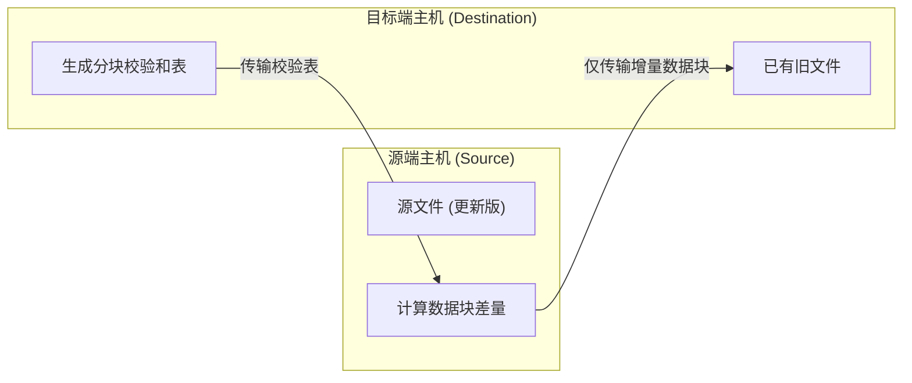

rsync 通过滚动校验和算法比对源端与目标端文件的块级差异，仅在网络中传输变更的数据块。该机制使大文件的增量备份和跨服务器目录镜像同步具备极高的数据吞吐效率。

## 增量传输与属性保留机制

常规复制命令在同步已有文件时执行全量覆盖。rsync 将目标文件切分为固定大小的数据块并计算校验和，源端比对本地数据后仅发送发生变动的差量字节。

除数据内容外，rsync 支持完整保留文件的 Unix 元数据，包括访问权限、文件所有者、所属组、修改时间戳、软硬链接以及特殊设备节点。



## 路径末尾斜杠的行为语义

源路径末尾是否存在斜杠 `/` 直接改变目标目录的结构层级。

### 不带末尾斜杠

源路径不带斜杠时，rsync 将源目录本身连同其内容整体复制到目标路径下方。

```bash
rsync -av /data/src /backup/dest
# 目标端生成路径：/backup/dest/src/...
```

### 带有末尾斜杠

源路径带有斜杠时，rsync 仅复制源目录内部的文件与子目录，不创建顶层目录名称。

```bash
rsync -av /data/src/ /backup/dest
# 目标端直接平铺文件：/backup/dest/...
```

## 核心参数功能对照

| 参数组合 | 参数全称 | 功能描述 |
| --- | --- | --- |
| `-a` | `--archive` | 归档模式，等价于 `-rlptgoD`，递归复制并保留全部元数据 |
| `-v` | `--verbose` | 输出详细的文件传输清单与统计摘要 |
| `-z` | `--compress` | 网络传输中启用实时流式数据压缩 |
| `-P` | `--partial --progress` | 打印实时传输进度条并保留未完成的断点数据块 |
| `-n` | `--dry-run` | 演练模式，仅打印将要变更的文件列表而不进行实际读写 |
| `--delete` | `--delete` | 镜像同步，从目标端移除源端已不存在的陈旧文件 |
| `--exclude` | `--exclude=PATTERN` | 按照 Glob 规则排除指定的文件或目录路径 |
| `-e` | `-e COMMAND` | 指定底层远程传输通道，常用于配置自定义 SSH 端口 |

## 常见备份与远程同步操作

### 本地目录增量归档

将本地工作目录下的数据同步至备份盘挂载点，同时展示传输进度并保留未完成切片。

```bash
rsync -avP /var/www/html/ /mnt/backup/html/
```

### 单向镜像同步与删除演练

使用 `--delete` 可以使目标端成为源端的镜像副本。为避免误删文件，正式同步前必须使用 `-n` 参数演练并核对即将被删除的文件列表。

```bash
# 1. 模拟执行，核对删除清单
rsync -avP --delete --dry-run /local/src/ /backup/dest/

# 2. 确认无误后执行正式同步
rsync -avP --delete /local/src/ /backup/dest/
```

### 规则排除过滤

在工程项目备份中，通常需要排除庞大的依赖缓存与临时日志文件。

```bash
rsync -avP --exclude="node_modules/" --exclude=".git/" --exclude="*.log" /app/ /backup/app/
```

### 远程 SSH 增量拉取与推送

rsync 默认通过 SSH 隧道进行端到端加密传输。

```bash
# 推送本地数据到远程主机
rsync -avzP /local/data/ user@192.168.1.100:/remote/data/

# 从远程主机拉取数据到本地
rsync -avzP user@192.168.1.100:/remote/data/ /local/data/

# 指定非默认 SSH 端口（如 2222）
rsync -avzP -e "ssh -p 2222" /local/data/ user@192.168.1.100:/remote/data/
```

### 传输中断续传

传输几十吉字节的大型压缩包或镜像文件时，如果网络意外中断，`-P` 参数会保留以临时形式命名的已传输数据块。重新运行相同命令时，rsync 校验断点并仅拉取剩余字节。

```bash
rsync -avP user@192.168.1.100:/remote/dataset.tar.gz /local/data/
```
