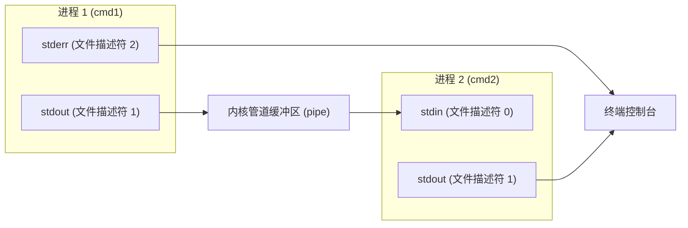

Unix 管道符 `|` 将前一个进程的标准输出文件描述符直接连接到后一个进程的标准输入文件描述符。数据在内核缓冲区中以字节流形式传递，中间过程不写入磁盘文件。

## 标准文件描述符与内核重定向

每个 Unix 进程在启动时默认打开三个文件描述符，分别是标准输入（描述符 0）、标准输出（描述符 1）和标准错误（描述符 2）。

执行 `cmd1 | cmd2` 时，Shell 调用系统调用 `pipe()` 创建内核管道，分别得到读端和写端两个描述符。随后 Shell 通过 `fork()` 衍生两个子进程，在 `cmd1` 子进程中通过 `dup2()` 将标准输出（描述符 1）重定向至管道写端，在 `cmd2` 子进程中将标准输入（描述符 0）重定向至管道读端。两端进程并发运行，内核在写端缓冲区填满时暂停写进程，在读端缓冲区为空时暂停读进程。

标准管道仅接管文件描述符 1。未重定向的标准错误（描述符 2）保留默认指向，直接输出到终端屏幕。



## 常见组合数据处理模式

通过组合单一职责的命令行工具，管道能完成多阶段的文本与进程检索任务。

### 结构化日志提取与频次统计

通过 `awk` 提取目标列，经由 `sort` 排序后使用 `uniq -c` 聚合计数，最后使用数值倒序输出频次最高的记录。

```bash
cat access.log | awk '{print $1}' | sort | uniq -c | sort -nr | head -n 10
```

### 进程过滤与特征字段提取

使用 `ps aux` 列出系统全局进程快照，通过 `grep -v "grep"` 排除检索进程自身，再由 `awk` 提取指定的进程号与资源占用率。

```bash
ps aux | grep "python" | grep -v "grep" | awk '{print $2, $3, $11}'
```

### 参数桥接与双向分流

部分系统命令（如 `rm`、`kill`、`cp`）仅接收命令行位置参数，不从标准输入读取数据。使用 `xargs` 可将管道传入的文本切分为独立参数传递给下游程序。

```bash
# 查找匹配文件并通过 xargs 转换为删除参数
find . -name "*.tmp" | xargs rm -f

# 使用 tee 在向控制台输出日志的同时追加写入目标文件
npm run build | tee -a build.log
```

## 错误流处理与执行状态陷阱

在脚本编写与自动化流水线中，管道处理涉及错误流合并、子进程变量隔离以及管道退出码判定等边界场景。

### 错误流重定向

默认管道无法捕获标准错误输出。需要捕获异常日志时，必须显式将描述符 2 合并至描述符 1。

```bash
# 通用写法：将描述符 2 重定向到描述符 1 之后传入管道
python script.py 2>&1 | grep "Error"

# Bash 4.0+ 与 Zsh 简写语法
python script.py |& grep "Error"
```

### 子进程变量隔离

管道各阶段在独立子进程（Subshell）中执行。在管道右侧循环体内对变量的赋值修改均发生在子进程内存空间内，无法回写至父进程。

```bash
# 错误写法：count 修改在子进程内，循环结束后父进程 count 仍为 0
count=0
cat data.txt | while read line; do
    count=$((count + 1))
done
echo "Total: $count"

# 正确写法：使用进程替换（Process Substitution）保持主进程环境
count=0
while read line; do
    count=$((count + 1))
done < <(cat data.txt)
echo "Total: $count"
```

### 管道整体退出状态码检测

默认情况下，整行管道命令的退出码 `$?` 仅继承最后一个命令的退出状态。如果前置命令执行失败但末尾命令正常退出，整体返回值依然为 0。

在脚本头部声明 `set -o pipefail`，管道会在任一环节命令返回非零值时，将该非零状态码作为整行命令的最终返回值。

```bash
set -o pipefail
cat non_existent_file.txt | echo "Done"
echo $?  # 返回非零错误码
```

## 常用管道操作对照

| 语法结构 | 数据流向说明 | 典型用途 |
| --- | --- | --- |
| `cmd1 \| cmd2` | `cmd1` 的 stdout(1) 连接至 `cmd2` 的 stdin(0) | `ls -l \| grep ".py"` |
| `cmd1 2>&1 \| cmd2` | 将 `cmd1` 的 stdout 与 stderr 同时传给 `cmd2` | `make 2>&1 \| grep "error"` |
| `cmd1 \|& cmd2` | `2>&1 \|` 的简写语法 (Bash 4.0+ / Zsh) | `pytest \|& less` |
| `cmd1 \| tee file` | stdout 同时输出至终端并写入指定文件 | `make \| tee build.log` |
| `cmd1 \| xargs cmd2` | 将 stdout 内容切分为位置参数供 `cmd2` 调用 | `find . -name "*.log" \| xargs rm` |
