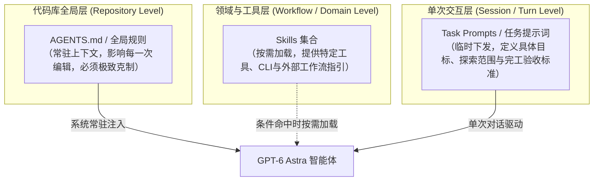
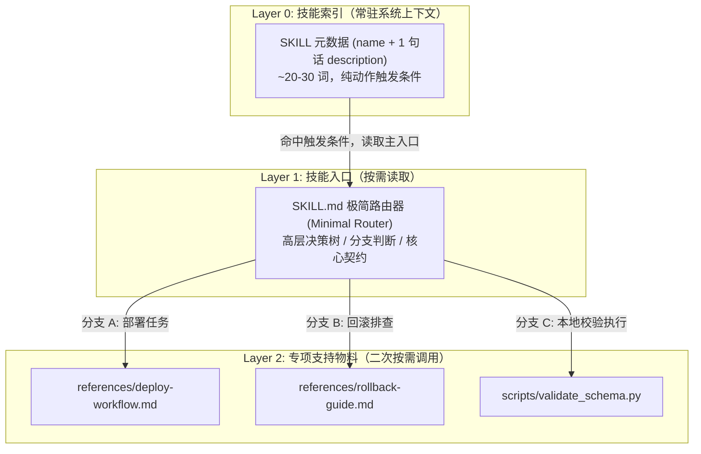

> **导读与背景**  
> 本文根据 OpenAI 开发者体验团队发布的官方博文《[Rethinking skills and prompts for GPT-6 Astra](https://developers.openai.com/blog/rethinking-skills-and-prompts-for-gpt-6-astra)》进行中英双语逐段对照精翻，并附带系统化的技术背景解读与工程批注。
>
> 随着底层代码智能体演进至 **GPT-6 Astra**，过去针对早期弱模型（如 GPT-5.6 Sol / Luna）沉淀的“微操式食谱”、“全局强制阅读”和“过度防备的防御性提示词”，如今正在变成阻碍智能体自主发挥的性能包袱。本文通过清晰的中英双语对照，并在每个核心议题后深度剖析架构考量与落地要点，为使用 Codex、Claude Code、Antigravity 等代码智能体的团队提供一套适应新一代大模型的提示词瘦身与架构升级指南。

---

## 0. 引言：智能体演进与范式转移 / Introduction

> **English Original**  
> Coding agents have come a long way, and best practices are changing fast. With more capable models, what used to require a lot of handholding and scaffolding no longer does.  
> 
> If you’ve been using agents like Codex for your projects over the last year, you’ve likely accumulated a lot of instructions as you worked to steer the models toward good outcomes. With each release, it’s been worth revisiting those assumptions, but with GPT-6 Astra, it’s more important than ever.  
> 
> These instructions can take many forms: skills, `AGENTS.md`, and your task prompts are all shaping how the model gets work done.

**中文对译**  
代码智能体（Coding Agents）的发展日新月异，最佳实践也在迅速迭代。随着底层模型能力的大幅跃升，以往那些需要大量人工保姆式搀扶与外围脚手架支持的做法，如今早已不再必要。

在过去这一年里，如果你一直在项目中使用 Codex 这类智能体，很可能为了引导模型产出理想结果，逐步堆积了大量细致入微的指导指令。每当新模型发布，我们都理应重新审视当年的预设；而随着 GPT-6 Astra 的登场，这种审视比以往任何时候都更加关键。

这些指令通常以多种形态存在：无论是技能（Skills）、代码库根目录下的 `AGENTS.md`，还是你日常下发的任务提示词（Task Prompts），都在潜移默化中塑造着模型完成工作的方式。

---

### 💡 工程批注 01：从“脚手架堆叠”到“内生自主”的跃迁

在 GPT-4 至 GPT-5.6 时代，智能体框架高度依赖**外部脚手架（Scaffolding）**与**防御性提示词（Defensive Prompting）**——开发者必须像教小孩学步一样，在 Prompt 里规定每一步“先做什么、再做什么、如何检查”。

然而，到了 GPT-6 Astra 这类经过更充分规划（Reasoning & Planning）与对齐调优的新一代模型，这种微操式指令反而会引发严重的副作用：
1. **注意力竞争（Attention Dilution）**：过度冗长的指令稀释了任务本身的重点，使模型在上下文窗口中顾此失彼。
2. **决策僵化（Overconstraint）**：模型具备根据代码上下文自主推理最优路径的能力，过细的固定步骤会剥夺其全局权衡的空间。

#### 代码库中的三层指令体系分工



---

## 1. 打造更精干高效的技能 / Better skills

### 1.1 技能载体与膨胀陷阱 / The Nature and Bloat of Skills

> **English Original**  
> These instructions can be in the form of skills, which are essentially prompts stored as Markdown files that can also be packaged with resources and bundled scripts. Generally, they are most useful for guidance around a specific workflow, or when using certain apps.  
> 
> People now default to packaging a lot of skills into their projects, and each skill comes with a name and description that are loaded into the model’s context so it knows when to use them. But many descriptions are far too long, and when you add too many skills, Codex starts shortening their descriptions to fit. The model ends up seeing less of each description, making it harder to know which skill to pick.  
> 
> What’s worse is that descriptions can often contradict each other or over-emphasize when skills should be used, leading the model to load instructions that don’t actually help the task.  
> 
> A common workflow to create skills is to use the `$skill-creator` skill. We recently updated its guidance to help mitigate many of the failure modes we’ve seen in practice.

**中文对译**  
这些指导指令最常见的载体之一就是技能（Skills）。从本质上看，Skills 就是以 Markdown 格式存储的提示词，同时能够打包附带相关资源文件与执行脚本。通常而言，它们在引导特定工程工作流或调用某些专属工具时最为见效。

如今，很多人习惯性地往项目里打包大量 Skills。每个 Skill 都包含名称和描述，这些元信息会被完整加载到模型的上下文窗口中，以便模型判断何时触发调用。然而，不少技能的描述写得过于冗长；一旦 Skills 数量过多，Codex 就会被迫截断这些描述以适应上下文限制。结果就是，模型看到的描述残缺不全，反而更难准确挑出最合适的那一个。

更糟糕的是，不同技能的描述之间往往互相矛盾，或者过度夸大自身的适用范围，最终导致模型加载了一堆对当前任务毫无助益的冗余指令。

目前创建技能的一个常见工作流是使用 `$skill-creator` 技能。我们近期全面更新了它的指引规范，旨在帮助大家规避在实践中频繁踩坑的各类失效模式。

---

### 💡 工程批注 02：系统提示词中的“静态税”与元数据截断

智能体系统（无论 Codex 还是 Antigravity）调度 Skill 的机制大致相同：**在会话初始化阶段，将所有可用 Skill 的 `name` 和 `description` 作为可用工具目录注入系统提示词**。

这意味着：
- **静态 Token 税（Static Tax）**：如果你配置了 25 个技能，每个描述写了 150 个词，那么仅描述目录就吃掉了接近 5000 tokens。每一次用户交互，这 5000 tokens 都在被重复计费并消耗注意力和带宽。
- **自动截断（Truncation）的危险**：当客户端检测到目录过大时，往往使用固定字符截断（如截取前 100 字符）。如果你的描述把“不要在 X 场景下使用”的负向约束写在末尾，截断后该否定条件丢失，将直接导致技能被错误触发（False Positive）。

---

### 1.2 规则一：清晰界定触发边界 / Be clear about when it applies

> **English Original**  
> First, skill descriptions should be as short as possible while making it clear when the model should use them:  
> 
> **Be clear about when it applies**  
> 
> **Bad**  
> `Create and validate Postgres schema migrations. Use when working with databases, queries, models, or persistence.`  
> 
> **Good**  
> `Create and validate Postgres schema migrations. Use when adding or changing a migration, or reviewing its rollout.`  
> 
> *Here, the bad skill description can push the model to use it anytime it touches anything related to a database, rather than only when it has to handle a migration.*

**中文对译**  
第一，技能描述务必力求简练，同时精准界定模型应该在何时调用它：

**清晰界定触发条件**

**❌ 反面案例（Bad）**  
> 创建并校验 Postgres Schema 迁移。在处理数据库、查询、模型或持久化层时使用。  
> `Create and validate Postgres schema migrations. Use when working with databases, queries, models, or persistence.`

**✅ 正面案例（Good）**  
> 创建并校验 Postgres Schema 迁移。在新增、修改迁移或审查其部署发布时使用。  
> `Create and validate Postgres schema migrations. Use when adding or changing a migration, or reviewing its rollout.`

*案例剖析：在反面案例中，过于泛化的描述会误导模型——只要任务涉及任何与数据库相关的代码（比如写一个简单的 SELECT 查询或修改 ORM 实体），就会盲目触发该技能，而不是仅在真正需要处理 Schema 迁移时才调用。*

---

### 💡 工程批注 03：动宾精准度与语义表面积（Semantic Surface Area）

为什么反面案例会导致频繁误触？核心在于**语义表面积过大**：
- 反面案例罗列了一系列宽泛的技术名词：`databases, queries, models, persistence`。在日常开发中，绝大多数日常操作（编写控制器、调整接口入参、修复查询 bug）都会命中这些词。模型在判断触发词时产生过度泛化，误以为只要看到数据库代码就必须加载几千字的迁移操作规范。
- 正面案例采用了**精准动宾短语（Verb-Object Trigger）**：`adding or changing a migration, reviewing its rollout`。这只在发生“创建迁移脚本”或“部署评审”这两个具体工程动作时才匹配，将技能触发的误报率降至最低。

| 维度 | 反面案例（Bad） | 正面案例（Good） |
| :--- | :--- | :--- |
| **描述侧重点** | 罗列宽泛的领域名词（Domain Listing） | 明确具体的操作动作（Action Trigger） |
| **触发敏感度** | 极易误触（写简单 SQL 都会加载技能） | 精确受控（仅迁移与部署阶段触发） |
| **上下文消耗** | 无论任务大小均可能白白引入数千字规范 | 仅在强相关时刻按需调入上下文 |

---

### 1.3 规则二：践行渐进式披露 / Progressive Disclosure

> **English Original**  
> Second, one of the key markers of a useful skill is progressive disclosure. Reading a skill takes up context, bringing you closer to compaction and introducing guidance that may not apply to the task. For skills with multiple workflows, make the root document a minimal router that points to supporting docs and scripts. Give the model enough guidance to know where to look without forcing it to read things that don’t matter in the moment.

**中文对译**  
第二，高效技能的关键标志之一，就是渐进式披露（Progressive Disclosure）。读取技能本身就会占用宝贵的上下文，不仅让你更快触及上下文压缩（Compaction）的阈值，还会引入与当前任务无关的噪声规则。

对于包含多条分支工作流的复杂技能，应当将根文档设计为一个**极简路由入口（Minimal Router）**，仅负责索引和指向具体的配套文档与脚本。给模型足够清晰的指引去按需定位，而绝不要迫使它在当下把所有细枝末节一口气全读进去。

---

### 💡 工程批注 04：极简路由与渐进式分层架构

**渐进式披露（Progressive Disclosure）**是人机交互与智能体系统设计中的通用顶层原则。在 LLM 交互中，它的核心价值在于：**不要一次性将所有可能用到的知识填满上下文**。

当上下文接近窗口上限时，模型或运行环境会触发**上下文压缩（Context Compaction）**——通过向量摘要或裁剪丢弃早期对话细节。过早引入无关技能文档，会直接加速触发 Compaction，导致真正核心的代码逻辑与用户要求被稀释或遗忘。

推荐的 Skill 三层分级架构如下：



---

### 1.4 规则三：摒弃保姆式的冗长食谱 / Avoid Elaborate Recipes

> **English Original**  
> Third, many skills were written as elaborate itineraries or recipes. Models have gotten much better at understanding nuance and ambiguity, so overly specific guidance can now hinder results where it previously helped.  
> 
> Repository skills also guide other contributors’ agents, which may use different models. Guidance that helps Sol or Luna may overconstrain GPT-6 Astra, so consider which models will use the instructions you leave behind.

**中文对译**  
第三，过去许多技能都被写成了详尽的操作流水账或死板菜谱。如今的模型在理解语境细微差别和模糊语义上已经突飞猛进，以往那些过度具体的条条框框，不仅不再是助力，反而容易束缚模型的手脚，限制最终的输出质量。

此外，代码仓库中的技能也会引导其他协作者的智能体，而他们使用的可能是完全不同的模型。那些曾经对 GPT-5.6 Sol 或 Luna 大有裨益的保姆式指引，对 GPT-6 Astra 来说可能就变成了过度约束。因此，在固化并沉淀指令时，务必长远考虑未来会有哪些模型来读取它们。

---

### 💡 工程批注 05：“过度约束综合征”与跨模型团队协作

早期模型由于推理能力弱，无法应对歧义，因此团队往往会编写非常详细的“操作菜谱（Recipes / Itineraries）”：
- *“第一步：打开 A 文件查找第 42 行；第二步：将其改写为 X 并在末尾添加单测；第三步：先不要运行测试，先手动核对 imports……”*

这种“微操式菜谱”在 GPT-6 Astra 下会引发**过度约束（Overconstraint）**问题：
1. **模型失去了针对特殊边缘情况灵活变通的能力**，即便是明显更优的现代语法或库函数，模型因为被旧菜谱捆死，也只能生成陈旧繁琐的代码。
2. **多模型生态冲突**：现代研发团队中，不同开发者可能混用不同版本的智能体模型（例如轻快型的 GPT-5.6 Sol、专注快速推理的 Luna、或是深层规划的 GPT-6 Astra）。将特定某一弱模型的防翻车规矩写死在仓库配置中，会降低使用更强模型的开发者的效率。

---

## 2. 让 AGENTS.md 紧跟模型演进 / Up-to-date AGENTS.md

### 2.1 全局规则常驻的代价与按需阅读 / Read What the Task Needs

> **English Original**  
> Because [`AGENTS.md`](https://agents.md/) applies whenever the model works in your repository, you should frequently revisit each instruction and ask yourself whether it’s still needed.  
> 
> Requiring a stack of docs or a full repo map before every edit is excessive for a typo fix. GPT-6 Astra can work out what it needs to read without being pushed to review the whole project before every change.  
> 
> **Read what the task needs**  
> 
> **Bad**  
> `Before every edit, read architecture.md, database.md, and deployment.md.`  
> 
> **Good**  
> `Use architecture.md for service boundaries, database.md for schema changes, and deployment.md when preparing a deployment.`  
> 
> *Prompting the model to read files before every edit is a great way to burn context and slow work down. Pointing to some docs can still be helpful, however, so long as it is contextual. Be sure to keep your docs updated too!*

**中文对译**  
鉴于 [`AGENTS.md`](https://agents.md/) 会在模型于你的代码库中工作的任何时刻全局生效，你应当经常复盘其中的每一条指令，认真审视它们是否依然必要。

在修复一个小小的拼写错误时，如果强制要求模型在每次修改前通读一整叠架构文档或完整的代码库地图，显然是过度工程。GPT-6 Astra 已经完全能够根据任务自行判断该阅读哪些文件，根本不需要每次都在改动前被强行推着去巡检整个项目。

**按任务需求定向阅读**

**❌ 反面案例（Bad）**  
> 每次修改代码前，通读 architecture.md、database.md 和 deployment.md。  
> `Before every edit, read architecture.md, database.md, and deployment.md.`

**✅ 正面案例（Good）**  
> 在厘清服务边界时参考 architecture.md，在处理数据架构变更时使用 database.md，在准备部署时查阅 deployment.md。  
> `Use architecture.md for service boundaries, database.md for schema changes, and deployment.md when preparing a deployment.`

*案例剖析：强制模型在每次改动前全量阅读文件，只会白白灼烧并挥霍宝贵的上下文，大幅拖慢工作进度。当然，指向关键文档依然很有帮助，但前提是必须按具体语境按需触发。同时，也请务必保持这些文档的时效性！*

---

### 💡 工程批注 06：上下文灼烧（Burning Context）与条件映射

`AGENTS.md` 是代码仓库的**全局系统提示词**，只要开启会话，它的内容就会被无条件注入。

如果在其中写下 `Before every edit, read ...`，就相当于对智能体下达了硬性前置拦截指令：
- 用户提了一个极小的需求：“请把登录页按钮文案从‘确定’改为‘登录’”。
- 智能体原本只需 2 秒钟定位模板文件并替换 2 个字符；
- 但由于这条全局规则，它被迫调起文件读取工具，逐一加载 `architecture.md`、`database.md`、`deployment.md` 共计上万 token 的内容；
- **结果**：Token 消耗翻了十倍，响应等待多出十几秒，宝贵的上下文被不相干的部署逻辑填满，甚至可能导致模型在改动按钮时莫名其妙联想到了部署回滚逻辑。

正面案例将其重构为**条件映射关系（Condition-to-Doc Mapping）**：告诉模型“遇到什么问题时，哪份文档是事实来源（Source of Truth）”，把“阅读动作”的决定权交还给具备自主判断力的 GPT-6 Astra。

---

### 2.2 自主测试与授权豁免 / Automated Testing & Scoped Permissions

> **English Original**  
> Previous models needed encouragement to run tests and check their work. GPT-6 Astra does that on its own, so the same instructions can lead to unnecessary testing.  
> 
> GPT-6 Astra is thorough, but it can be more tentative about how far to take a task. Sometimes it needs a little push to keep going. You can use `AGENTS.md` to give it permission for a specific workflow you know is safe, such as a local test suite:  
> 
> > The local tests use disposable fixtures and have no production access. Run them, fix failures caused by the requested change, and rerun affected tests without asking for approval at each step.

**中文对译**  
早期的模型往往需要不断被督促去运行测试和检查代码。而 GPT-6 Astra 天生就会主动自检，此时如果还保留那些陈旧的催促指令，反而会导致过度而无谓的频繁测试。

GPT-6 Astra 考虑十分周详，但在任务推进的深度上往往显得较为克制与试探，有时它确实需要一点明确的推动力来继续深入。你可以在 `AGENTS.md` 中为那些你明确知晓安全的工作流直接授权，例如本地测试套件：

> 本地测试使用一次性测试数据夹具（Disposable Fixtures），无生产环境访问权限。你可以直接运行测试，修复本次改动引发的失败，并重新运行相关测试，无需在每一步都停下来请求批准。  
> `The local tests use disposable fixtures and have no production access. Run them, fix failures caused by the requested change, and rerun affected tests without asking for approval at each step.`

---

### 💡 工程批注 07：模型性格的迁移——从“盲目鲁莽”到“谨慎试探”

从 GPT-4/5 到 GPT-6，模型行为模式发生了一个有趣的心理学转变：
- **早期模型（如 GPT-4 / 早期 Codex）**：倾向于“自信过头、写完就交差”，往往不主动运行测试，甚至把单测当摆设。因此，开发者必须在提示词里厉声催促：“必须运行测试！检查你的代码！”
- **GPT-6 Astra**：由于经过极高密度的强化学习与安全对齐，模型变得**极具敬畏心且相对克制（Tentative）**。它深知自己修改代码可能影响现有功能，因此在遇到不确定的操作时，第一反应往往是停下来向人类“请示批准”。

这就带来了一种新的体验断层：用户希望它自动修完 bug，它却每改一个函数就发消息问“我接下来可以跑测试吗？”、“测试挂了，我能改单测吗？”

**破局点：明确的安全隔离与预先授权（Scoped Pre-authorization）**。  
在 `AGENTS.md` 中向模型申明安全边界（如无生产环境访问、仅使用 Disposable Fixtures），并明确授予“运行测试 -> 修复失败 -> 重新验证”的闭环自治权，才能彻底释放其长程端到端能力。

---

## 3. 重新校准决策边界 / Decision boundaries

> **English Original**  
> Pay careful attention to how you describe boundaries. If a previous model did things on your behalf without permission, you may have added strong language to make it ask first. That can be useful, but GPT-6 Astra, as our most aligned model, has much better judgment and will not perform tasks unless it knows it is safe – so you should treat it as such.  
> 
> If you stated boundaries previously because you wanted to prevent other models from going too far and you’re now switching to GPT-6 Astra, consider updating that language: Astra could take it too seriously and may stop work where you’d actually be happy for it to continue.

**中文对译**  
在定义智能体的权限边界时，要格外留意你的措辞方式。如果之前的模型经常擅作主张、越权操作，你可能在提示词中加入过措辞严厉的限制，命令它“凡事必须先请示”。这种做法在过去确实有效，但作为我们对齐程度最高的模型，GPT-6 Astra 拥有成熟得多的常识判断力；除非确认安全无虞，否则它绝不会贸然越界——因此，你也应该给予它相应的信任。

如果你过去设立严苛的边界是为了防止某些模型“用力过猛”，而现在正逐步切换到 GPT-6 Astra，那么建议适度放宽这些措辞。因为 Astra 可能会把这些戒律执行得过于教条，在一些你原本十分乐见它自主推进的地方早早停滞不前。

---

### 💡 工程批注 08：对齐过载与“教条化停顿”

高对齐模型对于负向禁令词（如 `NEVER`, `MUST NOT`, `DO NOT ATTEMPT WITHOUT APPROVAL`）具有极高的惩罚敏感度。

很多工程师在仓库遗留了诸如：
- `DO NOT touch any config file without confirmation.`
- `Always ask before running any git command.`

当 GPT-6 Astra 看到这些禁令时，即使当前任务只是修改一个完全无害的本地 `.gitignore` 规则，或者只是执行 `git status` 查看变更，它也会被迫停滞，将执行链中断。

**策略调整**：
- **从“负向全面禁止”转向“正向安全白名单”**：
  - ❌ *不要执行任何未批准的终端命令。*
  - ✅ *在只读查询（如 git diff、git log）以及本地开发服务器构建（npm run build）范围内，你可以自主执行；仅涉及远程推送（git push）或生产环境操作时需暂停确认。*

---

## 4. 任务持久性与完工定义 / Persistence and Definition of Done

> **English Original**  
> If you’re used to GPT-5.6 Sol taking a request and continuing for long stretches, GPT-6 Astra can feel more tentative about when to stop. It may reach a first implementation and come back for your review while there’s still work to do.  
> 
> This is where it helps to define completion before starting. You might need to push Astra to continue until it’s fully done. If the task includes getting the implementation running, inspecting the result, and fixing what fails, make that part of the request. A requirement to stop for review after the first implementation will pull the model toward an earlier stopping point, so check whether that’s a decision you actually need to make.  
> 
> If you want it to keep exploring beyond a first pass, say what you want explored and where it should stop.  
> 
> A new model is a good opportunity to clean your house, but you don’t need to review everything manually: ask GPT-6 Astra to do an audit based on what was discussed in this article, then go build something you wouldn’t have attempted before!

**中文对译**  
如果你已经习惯了 GPT-5.6 Sol 拿到需求就能一气呵成、长程跑完整个流程，那么初用 GPT-6 Astra 时，可能会觉得它在判断何时停下来这件事情上略显犹豫。它常常在刚搞定初版实现后，就立刻带着成果返回请求你的审查，尽管后续还有不少收尾工作可以继续。

正因如此，在任务启动之前明确“完成的定义（Definition of Done）”至关重要。你可能需要主动推它一把，促使它坚持推进直到彻底完工。如果你的任务目标涵盖了“跑通实现、检查结果、修复失败问题”，请务必将这些完整步骤直接写入需求中。若是你要求它在搞出初版后就停下来等待审查，就会诱导模型倾向于更早中断执行——所以，仔细审视一下你是否真的需要每一步都介入审查。

如果你希望它在第一轮实现之外进一步发散探索，请直接讲明需要探索的方向以及最终在何处收拢。

新一代模型的登场，永远是为你的代码库指令做一次彻底“大扫除”的绝佳契机。但你完全不必事必躬亲地逐行审查：不妨直接让 GPT-6 Astra 结合本文探讨的最佳实践，对你的仓库来一次全面的自我体检，然后放手去打造那些你过去不敢轻易尝试的宏大创造吧！

---

### 💡 工程批注 09：GPT-5.6 Sol 与 GPT-6 Astra 的持久性分歧

这里 OpenAI 披露了一个非常关键的模型代际对比：
- **GPT-5.6 Sol**：代表了“长程自主运行（Long Stretches）”的激进路线。它在收到指令后，会倾向于沿着自己的推理路径一路狂奔数十回合，有时哪怕偏离了最初航道也会一直走到黑。
- **GPT-6 Astra**：代表了“以对齐与可控性为先”的审慎路线。它倾向于更早地交付阶段性成果（First Implementation）并请求人类反馈，避免在错误假设上过度浪费算力。

如果你需要 Astra 像 Sol 一样具备强大的**端到端穿透力**，关键在于**前置完工定义（Definition of Done, DoD）**：

```markdown
<!-- 模糊的任务下发（Astra 会在写完第一版代码后立即停下） -->
帮我把用户认证模块迁移到 JWT。

<!-- 明确 DoD 的任务下发（Astra 会自主闭环推进到底） -->
把用户认证模块迁移到 JWT。
【完成标准 (DoD)】：
1. 编写迁移代码与相关控制器；
2. 运行本地测试套件并自动修复任何兼容性错误；
3. 输出一份简要的变更清单说明已验证的用例；
在测试全部通过且代码格式校验无误之前，请自主推进，无需提前暂停询问。
```

---

## 5. 总结：代码库智能体配置大扫除清单 / Architecture Checklist

基于 OpenAI 的官方建议与上述深度批注，建议每个工程团队对照以下清单，对现存的 `AGENTS.md`、Skills 目录和日常 Prompt 模版做一次全面审计：

### 🛠️ 代码库指令优化自查表

| 检查维度 | 淘汰做法（针对旧模型的遗留包袱） | 升级做法（针对 GPT-6 Astra 的最佳实践） |
| :--- | :--- | :--- |
| **技能描述<br/>(Skill Description)** | 宽泛罗列技术领域（如 `Use for database, models, queries`），动辄几百字。 | 动宾精确短句（如 `Use when adding or changing a migration`），限制在 20 词以内。 |
| **技能结构<br/>(Skill Architecture)** | 将所有可能的分支说明和完整细节全部塞在单个长篇 Markdown 里。 | 采用**极简路由（Minimal Router）**，主文件仅做导航，具体子流程放入二级文档。 |
| **仓库规则<br/>(AGENTS.md)** | `Before every edit, read ...` 强制模型在修改前通读一堆核心文档。 | 改用**按需映射表**：仅在对应场景指明哪份文档是权威事实来源，让模型自主按需取用。 |
| **测试指引<br/>(Testing Guidance)** | 反复催促“每改一行都要运行全部测试并核对”。 | 赋予**安全环境预授权**（如说明测试采用一次性夹具），允许模型在闭环中自主修错。 |
| **决策边界<br/>(Safety Boundaries)** | 满篇充斥严厉的禁止性大写词汇（`NEVER DO X WITHOUT ASKING`）。 | 信任模型的高阶常识判断，放宽无害操作，明确定义安全边界与白名单操作。 |
| **任务下发<br/>(Task Prompts)** | 只说“帮我实现功能 X”，随后对模型中途过早停下感到困惑。 | 在 Prompt 中直接包含明确的 **Definition of Done (DoD)**，授权模型自测自修至绿灯。 |

正如文末所言，最好的方式莫过于**“以子之矛，攻子之盾”**：把这篇最佳实践直接作为提示词输入给 GPT-6 Astra，让它对你当前项目的 `AGENTS.md` 和全部 Skills 发起一次自动审查，剔除陈旧脚手架，让代码智能体以最轻盈、最高效的姿态投入核心创造之中。

---

## 原文与参考资料

- **OpenAI Developers Blog**: [Rethinking skills and prompts for GPT-6 Astra](https://developers.openai.com/blog/rethinking-skills-and-prompts-for-gpt-6-astra) (Published: 2026-09-13)
- **AGENTS.md Specification**: [https://agents.md/](https://agents.md/)
